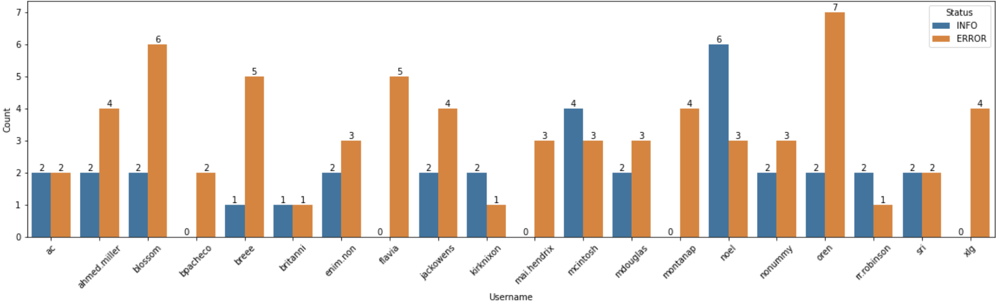

# log
> Displays Succesful/Unsuccesful Log

Transformation into the number of Successful/Unsuccessful logs made by each user by analyzing each line of the <code>sys.log</code> file.

## Visualization
I visualized the result using both the Matplotlib and Seaborn libraries.

